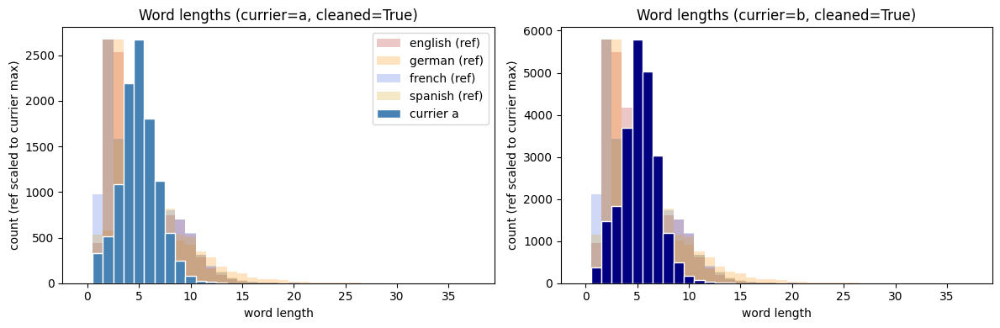
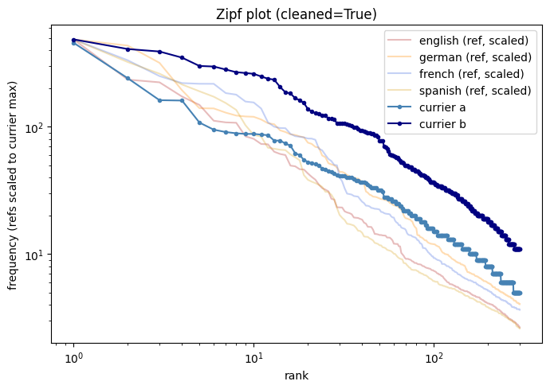
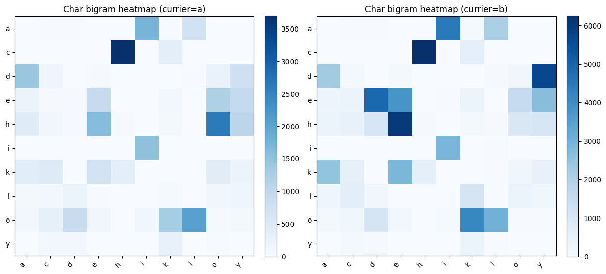
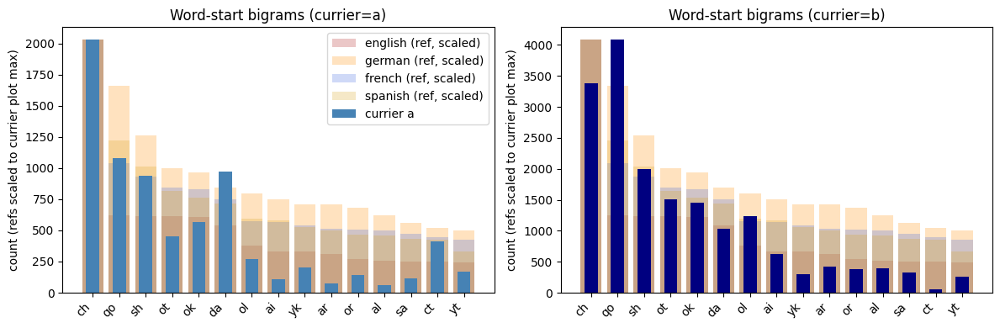
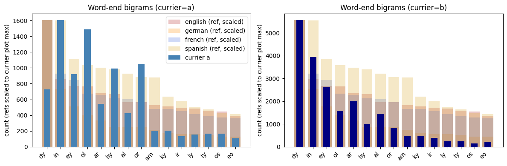
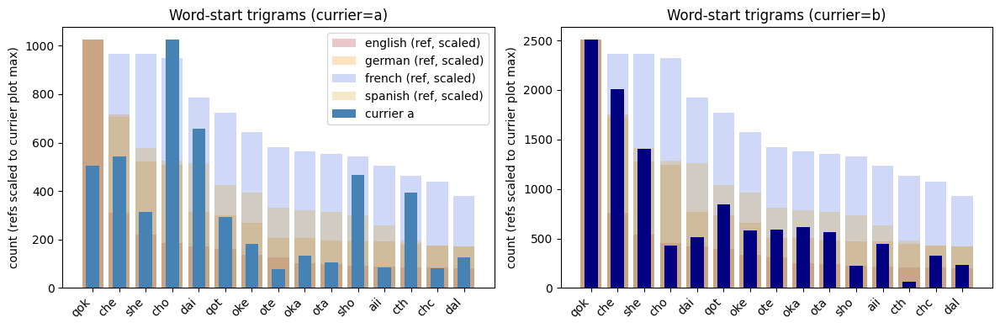
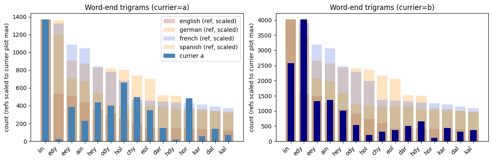

# Voynich statistical analysis
Technical notes live in `docs/TECHNICAL_OVERVIEW.md`. Notebooks: `voynich_word_stats.ipynb` (plots), `voynich_TF-IDF.ipynb` (similarity/key terms, to add).

## Introduction
This is a sandbox for exploring the Voynich manuscript text—no claims of originality or decryption goals. The aim is to build a flexible testbed: load, clean, and prepare the transcription; patch ambiguous tokens where possible; replicate known stats; then probe TF-IDF and other methods to see whether any semantic clustering aligns with visuals. Currier A vs B comparisons are a constant thread to understand how the two strata differ.

### Background literature
Media that informed this exploration are:
- Bowern and Lindemann (2020): The Linguistics of the Voynich Manuscript
- Topic Modeling in the Voynich Manuscript (2021)
- voynich.nu
- voynich.ninja Forum
- youtube.com/@voynichtalk

### Assumptions
I want to clearly state my initial assumptions when going into the text to make it easier to identify possible biases that may have been introduced by them.
1. The text is real in the sense that somebody in the 15th century wrote something down to communicate information to somebody else.
2. The transcription is reasonably good and conveys the textual content of the VMS to an overwhelming degree, so we can base an analysis on it.
3. The words are words in the sense that they can, through translation, combination, compression, augmentation by auxiliary information, or some other process, be rendered into a language that someone at some time spoke. If there is a cipher it did not jumble words by moving word boundaries or similar shenanigans.
4. Letters are only meaningful with regards to the manuscript itself. They cannot be identified in a one-to-one manner with any language.
5. The manuscript was written by several scribes/authors, possibly at different times, possibly without knowing each other. The known separations are Currier A and B as well as the 5 Hands (Davis, Lisa Fagin. 2020).
6. There is no hope of me ever decrypting the text since I have none of the necessary skills to actually understand any language that the authors spoke, even less the manuscript itself.

## Cleaning and ambiguity resolution
The transcription was normalized by using the first option, whenever two were present. Unclear transcriptions indicated by "?" were attempted to be resolved through (i) word frequency analysis and matching and (ii) bigram/trigram frequency analysis from Courrier-specific character n-gram models. Outputs are stored in `data/ambiguous_a.json`, `data/ambiguous_b.json` and can be fixed on an individual basis.

## Results

### Basic statistics

**Base statistics reproduce known properties of the VMS.**

#### Word length analysis
Word lengths show an unusual distribution compared to reference languages in both Currier A and B texts.

#### Zipf distribution
The Zipf curve mostly aligns with what is seen in other languages.

#### Letter bigram analysis
Letter bigrams within Currier A and B are very similar to each other and suggest different but very related language/encoding.

Purely based on bigrams, both Currier tests are visually much more similar than any of the 4 reference languages are to each other. (However, this result might be impacted by  total number of letters present in the VMS alphabet.)

#### Word start/end bigrams/trigrams

Word-initial and final bigrams differ noticeably between Currier A and B. Unclear yet whether the shapes diverge meaningfully from the reference languages given the smaller alphabet and token counts. Note: reference-language plots show most-common items in descending order, not aligned to the x-axis labels.

Trigrams show a similar split to the bigram plots, with the known overrepresentation of the -edy ending in Currier B.

### TF-IDF analysis

Results: similarity and key terms (to fill)
- Planned visuals: TF-IDF strongest terms by page, standout pages, cosine similarity heatmaps, nearest-neighbor tables.
- Will summarize and embed outputs from `voynich_TF-IDF.ipynb` or helper functions in `tfidf_keyness.py`.